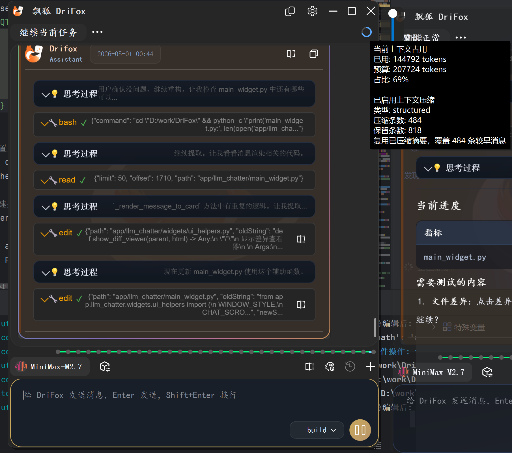

<!-- README.md -->
<p align="center">
  
</p>
<p align="center">
  
</p>

<div align="center">


</div>

<h1 align="center">DriFox 飘狐 — 一个轻量化 AI 桌面对话助手</h1>



---

## 设计理念

**不做大而全的 IDE。** DriFox 只是一个对话框 —— 随时调出，随意提问，随性分支。

| 特性 | 说明 |
|------|------|
| 🎯 **极简界面** | 仅一个悬浮置顶对话框，无项目概念，随开随用 |
| 🔀 **分支会话** | 问题分叉，多个窗口并行探索不同答案，互不干扰 |
| 🧩 **多窗口粘合** | 多个窗口粘合后可一起拖动一起管理，双击边框快速拆分 |
| 🧠 **长记忆** | 越用越懂你的偏好、习惯、禁忌 |
| 🔌 **Hook 系统** | 可扩展的事件钩子系统，支持在特定事件触发自定义脚本 |
| 🛠️ **代码工具** | 30+ 工具：读、写、搜索、执行、diff |
| 🔌 **多模型** | OpenAI / Claude / DeepSeek / MiniMax / 通义 等随时切换 |
| 🛡️ **穿透模式** | 悬浮窗口可穿透点击，不阻断其他应用 |
| 🚀 **自动更新** | 自动检查新版本，随时保持更新 |

---

## 快速开始

### 环境要求
- Python 3.8+
- PyQt5 >= 5.15.0

### 安装

```bash
git clone https://github.com/martin98-afk/DriFox.git
cd DriFox

# 创建虚拟环境
python -m venv .venv
source .venv/bin/activate  # Linux/Mac
.venv\Scripts\activate     # Windows

# 安装依赖
pip install -r requirements.txt
```

### 运行

```bash
python main.py
```

---

## 使用方式

### 基本操作
1. **提问** – 底部输入框发送消息，回车即发
2. **分支** – 标题栏点击「分支」按钮，从当前对话创建并行窗口
3. **复制窗口** – 创建多个独立对话框，同时处理不同任务

### 窗口操作
| 操作 | 说明 |
|------|------|
| 点击标题栏「分支」| 从当前对话分叉，创建新窗口继续探索 |
| 点击标题栏「复制」| 创建当前窗口的独立副本 |
| 拖拽标题栏 | 移动窗口位置 |
| `Ctrl+L` | 清除当前会话 |

### 浮动窗口特性
- **穿透模式**：鼠标可穿透窗口到达下层应用
- **透明度调节**：0-100% 可调
- **锁定按钮**：在穿透模式下仍可交互的独立控制点

---

## 核心架构

```
┌─────────────────────────────────────────────────────────┐
│                     DriFox 架构                         │
├─────────────────────────────────────────────────────────┤
│  UI 层                                                  │
│  ├── ToolPopupDialog – 浮动窗口容器（穿透/透明）         │
│  ├── OpenAIChatToolWindow – 主聊天窗口                  │
│  ├── MessageCard – 消息卡片渲染                         │
│  ├── DiffViewer – 代码差异对比视图                      │
│  ├── SegmentWidget – 分段任务窗口                       │
│  ├── HookSettingCard – Hook 设置卡片                    │
│  └── BottomInputArea – 底部输入区                      │
├─────────────────────────────────────────────────────────┤
│  引擎层                                                  │
│  ├── ChatEngine – 对话上下文组装与 LLM 调用              │
│  ├── ToolExecutor – 工具执行（文件/终端/网络）          │
│  ├── AgentManager – Agent 定义加载与切换                │
│  ├── ContextManager – Token 预算控制与压缩              │
│  ├── SubAgentExecutor – 子智能体并行执行                │
│  └── HookManager – Hook 生命周期管理与事件触发          │
├─────────────────────────────────────────────────────────┤
│  存储层                                                  │
│  ├── SessionManager – 会话管理                          │
│  ├── MemoryManager – 长期记忆（SQLite）                 │
│  ├── HistoryManager – 归档与检索                        │
│  └── SessionStore – SQLite 持久化                       │
└─────────────────────────────────────────────────────────┘
```

---

## Agent 系统

采用 **Primary / Subagent / Hidden** 三层设计，通过 Markdown + YAML frontmatter 定义：

| 类型 | Agent | 说明 |
|------|-------|------|
| **Primary** | `plan` | 任务规划与分解（只读）|
| **Primary** | `build` | 代码构建（全工具权限）|
| **Primary** | `code-reviewer` | 代码审查 |
| **Subagent** | `explore` | 代码库探索 |
| **Subagent** | `general` | 通用任务并行执行 |
| **Hidden** | `summary` | 信息总结 |
| **Hidden** | `compaction` | 上下文压缩 |
| **Hidden** | `title` | 会话标题生成 |

### Agent 定义示例

```markdown
---
name: build
mode: all
temperature: 0.3
permission:
  "*": allow
---

# Role
你是一个专业的 coding builder...
```

---

## 工具系统（30+）

### 内置工具 (BuiltinTools)

| 类别 | 工具 |
|------|------|
| **文件** | read, write, edit, multiedit, patch, grep, glob, list, diff |
| **执行** | bash, run_verify |
| **网络** | webfetch, websearch |
| **代码** | get_diagnostics |
| **记忆** | memory_save, memory_search, memory_list |
| **任务** | todowrite, todoread, task, task_batch, task_wait, skill |
| **其他** | scan_repo, stage_files, ask_question |

---

## Hook 系统

Hook 系统允许你在特定事件触发时执行自定义脚本，扩展 DriFox 的能力：

### 支持的事件类型
| 事件 | 触发时机 |
|------|----------|
| **SessionStart** | 新会话启动时 |
| **BeforeReply** | AI 回复之前 |
| **AfterReply** | AI 回复之后 |
| **ToolComplete** | 工具执行完成后 |

### Hook 配置
- 通过设置界面可视化配置 Hook
- 支持启用/禁用单个 Hook
- 支持自定义工作目录和环境变量
- 支持输出结构化显示

### Hook 脚本支持
- 支持任何可执行脚本（.py, .sh, .cmd, .bat 等）
- 事件信息通过环境变量传递给脚本
- 脚本输出会被捕获并显示在聊天窗口

---

## Skills 系统

Skills 是扩展 AI 能力的可安装模块，每个 Skill 包含 `SKILL.md` 定义工作流程：

### 内置 Skills (18个)

| Skill | 功能 | 触发条件 |
|-------|------|----------|
| **brainstorming** | 头脑风暴与创意发散 | 用户表达创意需求 |
| **caveman** | 极简压缩沟通（减少75% token）| 用户说 "caveman mode" |
| **diagnose** | 硬 bug 与性能回归诊断 | 用户报告 bug |
| **find-skills** | 发现和安装新技能 | 用户询问如何做某事 |
| **tdd** | 测试驱动开发（红-绿-重构）| 用户要求 TDD 开发 |
| **to-issues** | 将计划转换为 Issue 清单 | 用户需要拆解任务 |
| **write-a-skill** | 创建新的 Skill | 用户要创建技能 |
| **writing-plans** | 计划文档编写 | 用户有需求要规划 |
| **git-commit** | 智能 git 提交 | 用户要求提交代码 |
| **grill-me** | 挑战性提问评审 | 用户需要挑战性反馈 |
| **grill-with-docs** | 基于文档的问答评审 | 用户提供文档审查 |
| **triage** | 任务分类与优先级排序 | 用户需要任务分诊 |
| **improve-codebase-architecture** | 代码架构改进 | 用户要重构代码 |
| **setup-matt-pocock-skills** | Matt Pocock 学习路径 | 用户想学习技能 |
| **minimax-image-understanding** | MiniMax 图片理解 | 用户发送截图 |
| **zoom-out** | 宏观视角分析 | 用户需要全局视野 |
| **to-prd** | 需求文档生成 | 用户需要 PRD |
| **skill-creator** | Skill 创建指南 | 用户要创建技能 |

### Skill 标准结构

```
skill-name/
├── SKILL.md              # 主文件 (必需)
├── REFERENCES.md         # 参考文档 (可选)
├── scripts/              # 工具脚本 (可选)
├── references/           # 参考资料 (可选)
└── assets/               # 资源文件 (可选)
```

### SKILL.md 格式

```yaml
---
name: skill-name
description: "功能描述。Use when [触发条件]"
---

# 内容...
```

### 自定义 Skill

在 `.drifox/skills/<name>/` 下添加 Skill：

```bash
.drifox/skills/my-skill/
├── SKILL.md          # 必填，技能定义
└── references/       # 可选，参考文档
```

使用 `@技能名` 触发，如 `@brainstorming`

---

## 记忆系统

自动学习用户偏好，支持：
- **置信度评分**：每条记忆有 0-1 的置信度
- **冲突管理**：相同组的新记忆压制旧记忆
- **分类组织**：偏好/约束/习惯分类存储

### SQLite 数据库结构

数据库文件：`.drifox/sessions.db`

| 表名 | 用途 | 主要字段 |
|------|------|----------|
| `sessions` | 会话历史 | session_id, canvas_id, title, messages(JSON), system_prompt, compaction_state, created_at, updated_at |
| `memories` | 长期记忆 | memory_id, canvas_id, content, enabled, confidence, category, source, last_accessed |
| `file_operations` | 文件操作撤销 | id, session_id, call_id, tool_name, file_path, backup_path |

### 数据目录结构

```
.drifox/
├── sessions.db            # SQLite 数据库
├── skills/                # 用户自定义 skills
├── issues/               # Issue 追踪 (0001_xxx.md)
├── tasks/                # 定时任务 (.task.md)
├── backups/             # 增量备份 (UUID命名)
└── archived/            # 会话归档 (JSON格式)
```

### 归档策略

- **会话归档**：`.drifox/archived/*.json` - 压缩后的会话历史
- **文件备份**：`.drifox/backups/<UUID>/` - 文件修改前后备份
- **文件操作撤销**：通过 `file_operations` 表记录，支持回滚

---

## 项目结构

```
DriFox/
├── main.py                    # 运行入口
├── requirements.txt           # 依赖
├── app/
│   ├── main_widget.py         # 主窗口
│   ├── side_dock_area.py      # 浮动窗口管理
│   ├── agents/                # Agent 定义
│   │   ├── build.md
│   │   ├── plan.md
│   │   ├── explore.md
│   │   ├── summary.md
│   │   ├── compaction.md
│   │   └── ...
│   ├── skills/                # Skills 定义
│   │   ├── SKILLS.md
│   │   ├── brainstorming/
│   │   ├── tdd/
│   │   ├── caveman/
│   │   └── ...
│   ├── tools/                 # 工具实现
│   │   ├── __init__.py        # BuiltinTools 注册
│   │   ├── file_tools.py
│   │   ├── terminal_tools.py
│   │   ├── web_tools.py
│   │   ├── task_tools.py
│   │   └── diagnostics_tools.py
│   ├── core/                  # 核心引擎
│   │   ├── chat_engine.py
│   │   ├── agent_manager.py
│   │   ├── memory_manager.py
│   │   ├── context_manager.py
│   │   └── hook_manager.py     # Hook 管理
│   ├── utils/                 # 工具模块
│   │   ├── chat_session.py
│   │   ├── session_store.py
│   │   ├── memory_store.py
│   │   ├── config.py           # 配置与版本
│   │   └── update_checker.py   # 自动更新检查
│   └── widgets/               # UI 组件
│       ├── message_card.py
│       ├── diff_viewer.py
│       ├── segment_widget.py
│       ├── hook_setting_card.py # Hook 设置卡片
│       ├── context_usage_ring.py
│       └── ...
├── .drifox/                   # 应用数据
│   ├── sessions.db            # SQLite 会话与记忆
│   ├── skills/                # 用户自定义 skills
│   ├── issues/               # Issue 追踪
│   ├── tasks/                # 任务管理
│   ├── backups/              # 文件备份
│   └── archived/             # 归档会话
├── docs/
│   ├── adr/                  # 架构决策记录
│   └── superpowers/          # 扩展能力规格
├── icons/                    # 图标资源
└── images/                   # Logo 等图片
```

---

## 技术选型

| 技术 | 用途 |
|------|------|
| **PyQt5** | GUI 框架 |
| **PyQt-Fluent-Widgets** | Fluent Design 组件库 |
| **Loguru** | 日志系统 |
| **SQLite** | 会话与记忆持久化 |
| **OpenAI Python Client** | LLM API 调用 |
| **FastAPI** | 可能的 Web 扩展 |

---

## 开发者指南

### 自定义 Agent

在 `app/agents/` 创建 `.md` 文件：

```markdown
---
name: my_agent
mode: primary
permission:
  read: allow
  bash: ask
---
# My Agent
你的描述...
```

### 自定义 Skill

使用 `skill-creator` Skill 创建新技能：

```
.drifox/skills/my-skill/
├── SKILL.md          # 必填，技能定义
├── docs/             # 可选，参考文档
└── references/       # 可选，资源文件
```

使用 `@skill-creator` 开始创建流程。

### Issue 格式

在 `.drifox/issues/` 创建 `0001_问题名称.md`：

```markdown
# Issue 标题

## 严重程度: 高/中/低
## 状态: 待修复/进行中/已解决

## 问题描述
...

## 建议的修复方向
...

## 验证建议
...
```

### Task 格式

在 `.drifox/tasks/` 创建 `.task.md` 文件，详见 `docs/superpowers/specs/`。

### 工具注册

在 `app/tools/` 的对应模块中添加工具函数：

```python
# app/tools/file_tools.py
from app.tools import register_tool

@register_tool
def my_tool(arg1: str) -> ToolResult:
    """工具说明"""
    return ToolResult(success=True, data="result")
```

---

## 架构决策记录 (ADR)

项目维护架构决策文档，见 `docs/adr/0001-architecture-decisions.md`：

- ADR-0001: 内置工具集中注册
- ADR-0002: 会话持久化使用 SQLite
- ADR-0003: 浮动窗口穿透模式使用 Windows API
- ADR-0004: Agent 定义使用 Markdown + YAML frontmatter
- ADR-0005: 对话引擎依赖链注入
- ADR-0006: 测试优先顺序

---

## 更新日志

### v0.1.4 (2024)
- ✨ **Hook 管理系统**：新增 Hook 管理功能和可视化 UI 配置界面
- ✨ **自动更新**：添加自动检查更新功能
- 🐛 **Windows 兼容**：修复 Windows 平台下路径分隔符和编码问题
- 🔧 **架构重构**：移除任务观察系统，重构聊天引擎架构和后端内存管理
- 🔧 **技能管理**：重构技能管理功能以统一实现
- 🎨 **UI 优化**：重构 Hook 设置卡片布局

### v0.1.2
- 新增多窗口粘合功能：支持窗口一起拖动一起管理，双击粘合边框可自动拆分
- 优化多窗口布局和管理体验
- 支持不同大小窗口粘合

### v0.1.1
- 基础对话功能
- 分支会话
- 工具系统
- 记忆系统

---

## 许可证

MIT License

---

## 致谢

- [PyQt-Fluent-Widgets](https://github.com/zhiyiYo/PyQt-Fluent-Widgets) – UI 库
- [Loguru](https://github.com/Delgan/loguru) – 日志
- [OpenAI Python Client](https://github.com/openai/openai-python) – API 客户端
- [FastAPI](https://github.com/tiangolo/fastapi) – Web 框架

---

## Star History

<a href="https://www.star-history.com/#martin98-afk/DriFox&type=date&legend=top-left">
 <picture>
   <source media="(prefers-color-scheme: dark)" srcset="https://api.star-history.com/svg?repos=martin98-afk/DriFox&type=date&theme=dark&legend=top-left" />
   <source media="(prefers-color-scheme: light)" srcset="https://api.star-history.com/svg?repos=martin98-afk/DriFox&type=date&theme=dark&legend=top-left" />
   
 </picture>
</a>