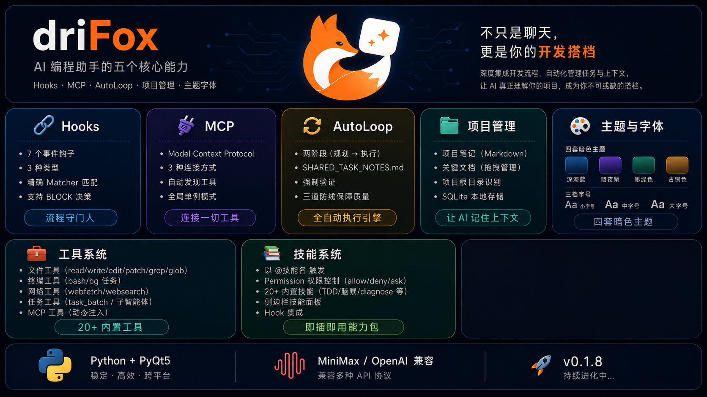
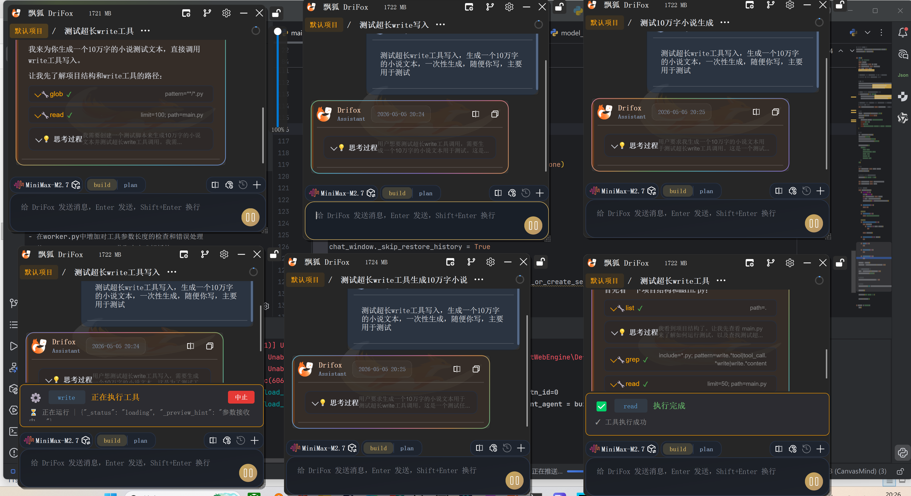
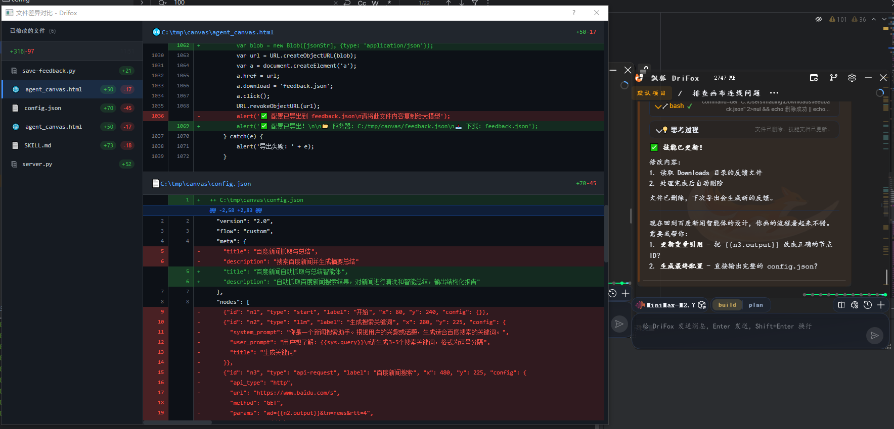
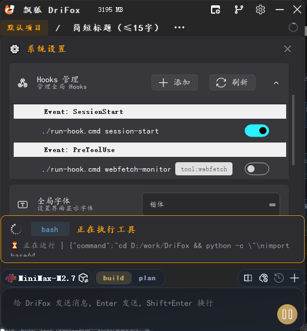

<!-- README.md -->
<p align="center">
  
</p>
<p align="center">
  
</p>

<div align="center">


</div>

<h1 align="center">DriFox 飘狐 — 一个轻量化 AI 桌面对话助手</h1>

---

## 设计理念

**不做大而全的 IDE。** DriFox 只是一个对话框 —— 随时调出，随意提问，随性分支。




### 核心特性

| 特性              | 说明                                               |
|-----------------|--------------------------------------------------|
| 🎯 **极简界面**     | 仅一个悬浮置顶对话框，随开随用                                  |
| 🔀 **分支会话**     | 问题分叉，多个窗口并行探索不同答案，互不干扰                           |
| 🔄 **会话并行**     | 多窗口并行处理不同任务，会话管理+历史追踪                            |
| 📊 **上下文压缩**    | 智能 Token 预算控制，长对话自动摘要压缩                          |
| 🧠 **长记忆**      | 越用越懂你的偏好、习惯、禁忌                                   |
| 🔌 **Hook 系统**  | 可扩展的事件钩子系统，支持在特定事件触发自定义脚本                        |
| 🌐 **MCP 系统**   | Model Context Protocol 支持，连接任意 MCP Server 扩展工具能力 |
| 🧩 **Skill 系统** | 支持自动检测 系统.agents、.drifox文件夹下的 Skill 模块，并自带有常用技能  |
| 🛠️ **代码工具**    | 30+ 工具：读、写、搜索、执行、diff                            |
| 🔌 **多模型**      | OpenAI / Claude / DeepSeek / MiniMax / 通义 等随时切换  |
| 🛡️ **穿透模式**    | 悬浮窗口可穿透点击，不阻断其他应用                                |
| 🚀 **自动更新**     | 自动检查新版本，随时保持更新                                   |

---

## 快速开始

### 环境要求
- Python 3.8+
- PyQt5 >= 5.15.0

### 安装

```bash
git clone https://github.com/martin98-afk/DriFox.git
cd DriFox

# 创建虚拟环境
python -m venv .venv
source .venv/bin/activate  # Linux/Mac
.venv\Scripts\activate     # Windows

# 安装依赖
pip install -r requirements.txt
```

### 运行

```bash
python main.py
```

---

## 核心功能详解

### 会话并行

DriFox 支持多窗口并行处理不同任务，让你可以同时探索多个解决方案。



| 功能 | 说明 |
|------|------|
| 分支会话 | 从当前对话分叉，创建独立的新窗口 |
| 会话管理 | 查看最近会话和最活跃会话，方便任务切换 |
| 并行探索 | 多个窗口同时运行，互不干扰 |
| 待办追踪 | 内置待办清单功能，跟踪任务进度 |

---

### 代码差异对比

DriFox 内置可视化的代码差异对比工具，让你可以清晰看到 AI 助手的修改内容。



| 功能 | 说明 |
|------|------|
| 文件列表 | 侧边栏显示所有已修改的文件及其增减行数 |
| 差异高亮 | 新增内容绿色显示，删除内容红色显示 |
| 多文件对比 | 支持同时查看多个文件的修改 |
| 统计摘要 | 显示总体的代码增减统计 |

---

### 上下文压缩

DriFox 内置智能的上下文压缩系统，确保长对话不会超出 Token 限制。


| 机制 | 说明 |
|------|------|
| Token 预算控制 | 实时显示当前上下文占用和预算上限 |
| 智能压缩策略 | 尾保留策略 + 工具调用配对保护 |
| LLM 摘要 | 使用专门的 compaction agent 生成摘要 |
| 可视化显示 | 通过环形图直观显示占用比例 |

**压缩触发条件：**
- Token 占用超过预算阈值（默认 80%）
- 工具迭代中自动增量压缩
- 手动触发压缩（通过指令）

---

### Hook 系统

DriFox 支持通过可视化界面配置和管理 Hook 事件钩子。



#### 支持的事件类型

| 事件 | 触发时机 |
|------|----------|
| **SessionStart** | 新会话启动时 |
| **PreUserMessage** | 用户消息发送前 |
| **PostUserMessage** | 用户消息发送后 |
| **PreAssistantMessage** | AI 助手回复前 |
| **PreToolUse** | 工具执行前（可 BLOCK） |
| **PostToolUse** | 工具执行后 |

#### Hook 配置

- 通过设置界面可视化配置 Hook
- 支持启用/禁用单个 Hook
- 支持自定义工作目录和环境变量
- 支持输出结构化显示
- 支持三种类型：**command** / **http** / **python function**

#### 决策控制

Hook 可通过以下方式控制流程：
- Exit code 2 → BLOCK（跳过工具执行）
- JSON 输出 `{"decision": "block"}` → BLOCK
- JSON 输出 `{"decision": "continue"}` → 继续

---

### MCP 系统

DriFox 支持通过 [Model Context Protocol (MCP)](https://modelcontextprotocol.github.io/) 扩展 AI 工具能力，可连接任意 MCP Server 并直接调用其提供的工具。


#### 支持的服务器类型

| 类型 | 说明 |
|------|------|
| **stdio** | 通过标准输入/输出通信，适用于本地命令行工具（如 `npx @modelcontextprotocol/server-filesystem`）|
| **sse** | 通过 Server-Sent Events 通信，适用于 HTTP 服务器 |
| **http** | 通过 Streamable HTTP 通信，适用于现代 MCP HTTP 端点 |

#### MCP 工具使用

- 配置好 MCP Server 后，工具会自动出现在 AI 的可用工具列表中
- MCP 工具名格式：`mcp__{server_name}__{tool_name}`，如 `mcp__github__create_issue`
- 连接/断开服务器无需重启软件，配置变更即时生效
- 多窗口共享同一个 MCP 连接池，高效利用系统资源

#### 常用 MCP Server 推荐

```bash
# 文件系统
npx -y @modelcontextprotocol/server-filesystem /path/to/directory

# GitHub API
npx -y @modelcontextprotocol/server-github

# Playwright 浏览器自动化
npx -y @modelcontextprotocol/server-playwright

# PostgreSQL 数据库
npx -y @modelcontextprotocol/server-postgres postgresql://localhost/mydb

# Google Maps
npx -y @modelcontextprotocol/server-google-maps
```

#### 权限控制

所有 MCP 工具默认需要用户确认（`ask`），可在设置中调整权限规则。

---

### 浮动窗口特性

| 特性 | 说明 |
|------|------|
| 穿透模式 | 鼠标可穿透窗口到达下层应用 |
| 透明度调节 | 0-100% 可调 |
| 锁定按钮 | 在穿透模式下仍可交互的独立控制点 |

---

## 核心架构

```
┌─────────────────────────────────────────────────────────┐
│                     DriFox 架构                         │
├─────────────────────────────────────────────────────────┤
│  UI 层                                                  │
│  ├── ToolPopupDialog – 浮动窗口容器（穿透/透明）         │
│  ├── OpenAIChatToolWindow – 主聊天窗口                  │
│  ├── MessageCard – 消息卡片渲染                         │
│  ├── DiffViewer – 代码差异对比视图                      │
│  ├── SegmentWidget – 分段任务窗口                       │
│  ├── HookSettingCard – Hook 设置卡片                    │
│  ├── MCPListSettingCard – MCP Server 配置卡片            │
│  └── BottomInputArea – 底部输入区                      │
├─────────────────────────────────────────────────────────┤
│  引擎层                                                  │
│  ├── ChatEngine – 对话上下文组装与 LLM 调用              │
│  ├── ContextBuilder – 消息规范化与系统提示注入          │
│  ├── ToolExecutor – 工具执行（文件/终端/网络）          │
│  ├── AgentManager – Agent 定义加载与切换                │
│  ├── HistoryCompactor – 上下文压缩                       │
│  ├── SubAgentExecutor – 子智能体并行执行                │
│  └── HookManager – Hook 生命周期管理与事件触发          │
├─────────────────────────────────────────────────────────┤
│  存储层                                                  │
│  ├── SessionManager – 会话管理                          │
│  ├── MemoryManager – 长期记忆（SQLite）                 │
│  ├── HistoryManager – 归档与检索                        │
│  └── SessionStore – SQLite 持久化                       │
└─────────────────────────────────────────────────────────┘
```

---

## Agent 系统

采用 **Primary / Subagent / Hidden** 三层设计，通过 Markdown + YAML frontmatter 定义：

| 类型 | Agent | 说明 |
|------|-------|------|
| **Primary** | `plan` | 任务规划与分解（只读）|
| **Primary** | `build` | 代码构建（全工具权限）|
| **Primary** | `code-reviewer` | 代码审查 |
| **Subagent** | `explore` | 代码库探索 |
| **Subagent** | `general` | 通用任务并行执行 |
| **Hidden** | `summary` | 信息总结 |
| **Hidden** | `compaction` | 上下文压缩 |
| **Hidden** | `title` | 会话标题生成 |

### Agent 定义示例

```markdown
---
name: build
mode: all
temperature: 0.3
permission:
  "*": allow
---

# Role
你是一个专业的 coding builder...
```

---

## 工具系统（30+）

### 内置工具

| 类别 | 工具 |
|------|------|
| **文件** | read, write, edit, multiedit, patch, grep, glob, list, diff |
| **执行** | bash, run_verify |
| **网络** | webfetch, websearch |
| **代码** | get_diagnostics |
| **记忆** | memory_save, memory_search, memory_list |
| **任务** | todowrite, todoread, task, task_batch, task_wait, skill |
| **MCP** | `mcp__server__tool` — 连接 MCP Server 后自动出现 |
| **其他** | scan_repo, stage_files, ask_question |

---

## Skills 系统

Skills 是扩展 AI 能力的可安装模块，每个 Skill 包含 `SKILL.md` 定义工作流程。

### 内置 Skills (18个)

| Skill | 功能 | 触发条件 |
|-------|------|----------|
| brainstorming | 头脑风暴与创意发散 | 用户表达创意需求 |
| caveman | 极简压缩沟通（减少75% token）| 用户说 "caveman mode" |
| diagnose | 硬 bug 与性能回归诊断 | 用户报告 bug |
| find-skills | 发现和安装新技能 | 用户询问如何做某事 |
| tdd | 测试驱动开发（红-绿-重构）| 用户要求 TDD 开发 |
| to-issues | 将计划转换为 Issue 清单 | 用户需要拆解任务 |
| write-a-skill | 创建新的 Skill | 用户要创建技能 |
| writing-plans | 计划文档编写 | 用户有需求要规划 |
| git-commit | 智能 git 提交 | 用户要求提交代码 |
| grill-me | 挑战性提问评审 | 用户需要挑战性反馈 |
| grill-with-docs | 基于文档的问答评审 | 用户提供文档审查 |
| triage | 任务分类与优先级排序 | 用户需要任务分诊 |
| improve-codebase-architecture | 代码架构改进 | 用户要重构代码 |
| setup-matt-pocock-skills | Matt Pocock 学习路径 | 用户想学习技能 |
| minimax-image-understanding | MiniMax 图片理解 | 用户发送截图 |
| zoom-out | 宏观视角分析 | 用户需要全局视野 |
| to-prd | 需求文档生成 | 用户需要 PRD |
| skill-creator | Skill 创建指南 | 用户要创建技能 |

### Skill 标准结构

```
skill-name/
├── SKILL.md              # 主文件 (必需)
├── references/           # 参考文档 (可选)
├── scripts/               # 工具脚本 (可选)
└── assets/               # 资源文件 (可选)
```

### 自定义 Skill

在 `.drifox/skills/<name>/` 下添加 Skill，使用 `@技能名` 触发。

---

## 记忆系统

自动学习用户偏好，支持：
- **置信度评分**：每条记忆有 0-1 的置信度
- **冲突管理**：相同组的新记忆压制旧记忆
- **分类组织**：偏好/约束/习惯分类存储

### SQLite 数据库

数据库文件：`.drifox/sessions.db`

| 表名 | 用途 | 主要字段 |
|------|------|----------|
| sessions | 会话历史 | session_id, title, messages, compaction_state, created_at |
| memories | 长期记忆 | memory_id, content, confidence, category, source |
| file_operations | 文件操作撤销 | id, tool_name, file_path, backup_path |

### 数据目录

```
.drifox/
├── sessions.db            # SQLite 数据库
├── skills/                # 用户自定义 skills
├── issues/               # Issue 追踪
├── tasks/                # 定时任务
├── backups/             # 增量备份
└── archived/            # 会话归档
```

---

## Roadmap

以下功能正在规划中：

| 功能 | 说明 | 状态 |
|------|------|------|
| 🧩 **多窗口粘合** | 窗口组管理，多个窗口粘合后可一起拖动一起管理 | 🔜 开发中 |

---

## 开发者指南

### 自定义 Agent

在 `app/agents/` 创建 `.md` 文件：

```markdown
---
name: my_agent
mode: primary
permission:
  read: allow
  bash: ask
---
# My Agent
你的描述...
```

### 自定义 Skill

使用 `@skill-creator` 开始创建流程。

### 工具注册

在 `app/tools/` 的对应模块中添加工具函数：

```python
# app/tools/file_tools.py
from app.tools import register_tool

@register_tool
def my_tool(arg1: str) -> ToolResult:
    """工具说明"""
    return ToolResult(success=True, data="result")
```

### Issue 格式

在 `.drifox/issues/` 创建 `0001_问题名称.md`：

```markdown
# Issue 标题

## 严重程度: 高/中/低
## 状态: 待修复/进行中/已解决

## 问题描述
...

## 建议的修复方向
...
```

---

## 项目结构

```
DriFox/
├── main.py                    # 运行入口
├── requirements.txt           # 依赖
├── app/
│   ├── main_widget.py         # 主窗口
│   ├── side_dock_area.py      # 浮动窗口管理
│   ├── agents/                # Agent 定义
│   ├── skills/                # Skills 定义
│   ├── tools/                 # 工具实现
│   │   ├── file_tools.py
│   │   ├── terminal_tools.py
│   │   ├── web_tools.py
│   │   ├── task_tools.py
│   │   └── diagnostics_tools.py
│   ├── core/                  # 核心引擎
│   │   ├── chat_engine.py
│   │   ├── context_builder.py
│   │   ├── history_compactor.py
│   │   ├── agent_manager.py
│   │   ├── memory_manager.py
│   │   └── hook_manager.py
│   ├── widgets/               # UI 组件
│   └── utils/                 # 工具模块
├── .drifox/                   # 应用数据
├── docs/
│   ├── adr/                  # 架构决策记录
│   └── superpowers/          # 扩展能力规格
└── images/                   # 图片资源
```

---

## 技术选型

| 技术 | 用途 |
|------|------|
| PyQt5 | GUI 框架 |
| PyQt-Fluent-Widgets | Fluent Design 组件库 |
| Loguru | 日志系统 |
| SQLite | 会话与记忆持久化 |
| OpenAI Python Client | LLM API 调用 |

---

## 更新日志

### v0.1.4 (2024)
- ✨ Hook 管理系统：新增 Hook 管理功能和可视化 UI 配置界面
- ✨ 自动更新：添加自动检查更新功能
- 🐛 Windows 兼容：修复 Windows 平台下路径分隔符和编码问题
- 🔧 架构重构：移除任务观察系统，重构聊天引擎架构和后端内存管理
- 🔧 技能管理：重构技能管理功能以统一实现
- 🎨 UI 优化：重构 Hook 设置卡片布局

### v0.1.2
- 新增多窗口粘合功能：支持窗口一起拖动一起管理，双击粘合边框可自动拆分
- 优化多窗口布局和管理体验
- 支持不同大小窗口粘合

### v0.1.1
- 基础对话功能
- 分支会话
- 工具系统
- 记忆系统

---

## 许可证

MIT License

---

## 致谢

- [PyQt-Fluent-Widgets](https://github.com/zhiyiYo/PyQt-Fluent-Widgets) – UI 库
- [Loguru](https://github.com/Delgan/loguru) – 日志
- [OpenAI Python Client](https://github.com/openai/openai-python) – API 客户端

---

## Star History

<a href="https://www.star-history.com/#martin98-afk/DriFox&type=date&legend=top-left">
 <picture>
   <source media="(prefers-color-scheme: dark)" srcset="https://api.star-history.com/svg?repos=martin98-afk/DriFox&type=date&theme=dark&legend=top-left" />
   <source media="(prefers-color-scheme: light)" srcset="https://api.star-history.com/svg?repos=martin98-afk/DriFox&type=date&theme=dark&legend=top-left" />
   
 </picture>
</a>